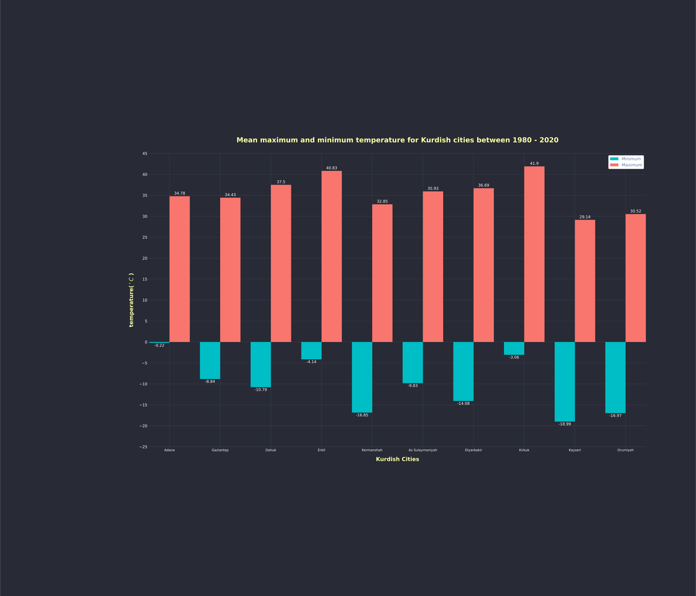

# Mean annual temperatures for Kurdish cities between 1980-2020

The mean annual temperature refers to the average of the maximum and minimum temperatures of a year, taking the mean average of the coldest month of the year and averaging it with the mean average of the hottest month of the year.

---

## Getting help

If you have questions about the python library **Kurdish** module, or run into problems, or if you want to contribute in any way, feel free to reach out to me via below links:

- **[GitHub](https://github.com/dolanskurd)**
- **[Twitter](http://www.twitter.com/dolanskurd)**
- **E-mail: [dolanskurd@mail.com](mailto:dolanskurd@mail.com)**