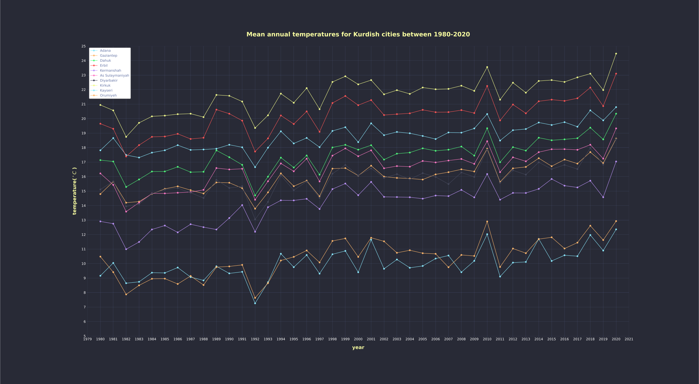
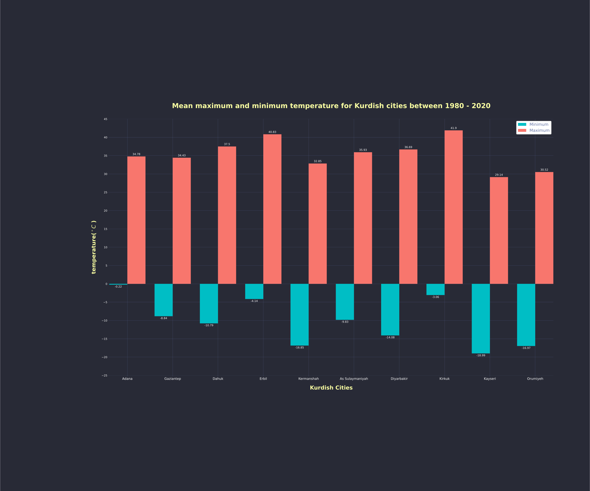

# Mean annual temperatures for Kurdish cities between 1980-2020

The mean annual temperature refers to the average of the maximum and minimum temperatures of a year.

*Source of the data:* [**Kaggle**](https://www.kaggle.com/datasets/hansukyang/temperature-history-of-1000-cities-1980-to-2020)

## Mean annual temperatures for Kurdish cities between 1980-2020

***Notes:***
- *Kurdish city names were spelled precisely as they appeared in the data, with no deliberate changes made.*
-  *The following table lists all of the cities that were included in the dataset.*

### Kurdish Cities (in English, [**Kurdish (ku)**](https://ku.wikipedia.org/wiki/Kurmanc%C3%AE) and [**Kurdish (ckb)**](https://ckb.wikipedia.org/wiki/%DA%A9%D9%88%D8%B1%D8%AF%DB%8C%DB%8C_%D9%86%D8%A7%D9%88%DB%95%D9%86%D8%AF%DB%8C)):

|English|**Kurmancî**|کوردی|
|-----|-----|---|
Adana|[**Edene**](https://ku.wikipedia.org/wiki/Edene)|ئەدەنە
Gaziantep|[**Dîlok**](https://ku.wikipedia.org/wiki/D%C3%AElok)|دیلۆک
Dahuk|[**Dihok**](https://ku.wikipedia.org/wiki/Dihok)|دهۆک
Erbil|[**Hewlêr**](https://ku.wikipedia.org/wiki/Hewl%C3%AAr_(paytext))|هەولێر
Kermanshah|[**Kirmaşan**](https://ku.wikipedia.org/wiki/Kirma%C5%9Fan)|کرماشان
As Sulaymaniyah|[**Silêmanî**](https://ku.wikipedia.org/wiki/Sil%C3%AAman%C3%AE_(bajar))|سلێمانی
Diyarbakir|[**Amed**](https://ku.wikipedia.org/wiki/Amed)|ئامەد
Kirkuk|[**Kerkûk**](https://ku.wikipedia.org/wiki/Kerk%C3%BBk)|کەرکوک
Kayseri|[**Qeyserî**](https://ku.wikipedia.org/wiki/Qeyser%C3%AE)|قەیسەری
Orumiyeh|[**Ûrmiye**](https://ku.wikipedia.org/wiki/%C3%9Brmiye)|ورمێ

- *Check the extracted [**cities.json**](./cities.json) file to acquire all the information supplied for each city in the dataset.*

---

## Specific day of the highest temperature between 1980 to 2020
|City|Date|Maximum Temperature|
|---|---|---|
Adana|1998-08-07|34.78
Gaziantep|1998-07-23|34.43
Dahuk|2011-07-28|37.5
Erbil|2000-07-30|40.83
Kermanshah|2015-07-02|32.85
As Sulaymaniyah|2000-07-17|35.93
Diyarbakir|2011-07-28|36.69
**Kirkuk**|**2011-07-28**|**41.9**
Kayseri|2010-08-02|29.14
Orumiyeh|2018-07-12|30.52

---

## Specific date of the lowest temperature between 1980 to 2020
|City|Date|Minimum Temperature|
|---|---|---|
Adana|2008-01-14|-0.22
Gaziantep|1997-02-05|-8.84
Dahuk|2002-12-27|-10.79
Erbil|1992-01-04|-4.14
Kermanshah|1983-01-27|-16.85
As Sulaymaniyah|1982-01-19|-9.83
Diyarbakir|1992-12-28|-14.08
Kirkuk|1985-02-22|-3.06
**Kayseri**|**2002-12-26**|**-18.99**
Orumiyeh|2008-01-08|-16.97

---

More details on Kurdish iso codes:
- [***Kurdish [kur]***](https://iso639-3.sil.org/code/kur)
- [***Central Kurdish [ckb]***](https://iso639-3.sil.org/code/ckb)

---

## Getting help

If you have questions about the python library **Kurdish** module, or run into problems, or if you want to contribute in any way, feel free to reach out to me via below links:

- **[GitHub](https://github.com/dolanskurd)**
- **[Twitter](http://www.twitter.com/dolanskurd)**
- **E-mail: [dolanskurd@mail.com](mailto:dolanskurd@mail.com)**